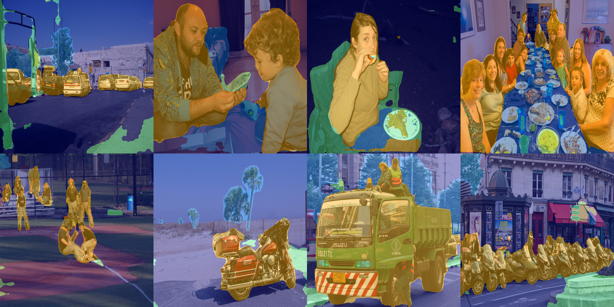

# Movability Segmentation

ELEG5491 course project, May 2025. A modified DeepLabV3 model assigns image pixels to four categories of object movability. The categories describe how objects typically move or can be moved; the model does not estimate physical momentum or observed motion.



Prediction overlays from Figure 5 of [the course report](report-2.pdf), labelled there as after epoch 50. This is an archived result, extracted without retraining or reproducing the experiment. [Source record](assets/provenance.json).

| Class ID | Report category | Report examples |
|---|---|---|
| 0 | Not Movable | Buildings, landscape, plantation |
| 1 | Normally Stable | Furniture, appliances, street facilities |
| 2 | Inactively Mobile | Clothes, foods, small objects |
| 3 | Highly Mobile | People, vehicles, animals |

The report names these classes, but its source-label ranges are approximate. [The explicit mapping](src/label_mapping.json) reproduces all 256 entries of the committed `src/lut_movability.npy` exactly. It preserves the archived mapping; it does not independently validate the underlying COCO-Stuff label convention.

## Setup and checks

```bash
python -m pip install -r requirements.txt
python src/create_lut.py --check
python -m unittest discover -s tests -v
```

The tests use synthetic masks and random CPU inputs. They check LUT preservation, data pairing, ignored pixels, global mIoU, loss behaviour, and output dimensions. They do not download weights, train a model, or reproduce report scores.

## Data

Provide matching image and single-channel integer PNG mask names in separate splits:

```text
dataset/
  images/train/example.jpg
  annotations/train/example.png
  images/val/example.jpg
  annotations/val/example.png
```

`train2017` / `val2017` directory names are also accepted. Choose the mask convention explicitly:

- `source`: map IDs through the archived LUT. Confirm that your dataset uses the same source IDs before training.
- `movability`: masks already contain IDs 0–3; do not apply the LUT again.

The loader treats source value 255 as ignored by default. `--source-ignore-label none` instead applies every LUT entry literally, including the archived `255 → 0` mapping. This is an explicit policy in the newly added loader; the missing original loader's treatment of void labels is unknown. RGB colour masks and unmatched image/mask pairs are rejected. Images become RGB float tensors in `[0, 1]`; by default, images and masks resize to 512 × 512, using bilinear and nearest-neighbour interpolation respectively.

## Training and inference

```bash
python src/train.py --data-root dataset --mask-encoding source --source-ignore-label 255
python src/infer.py --image test_image.jpg --weights checkpoints/best.pth --output result.png
```

Training defaults to pretrained torchvision weights and can download them; use `--no-pretrained` for random initialization. Inference constructs the architecture without downloading weights and loads the supplied checkpoint. Checkpoints and the original train/validation split are not included.

Use `--image-size HEIGHT WIDTH` to change the training resolution; the default remains 512 × 512. Inference uses the size saved in the checkpoint, or 512 × 512 for legacy checkpoints. Its `--image-size` option can override that size. Smaller synthetic inputs are useful for checking the software path; they do not reproduce the course experiment.

The maintenance changes add the missing dataset module, preserve input spatial dimensions, exclude ignored pixels from both loss terms, and accumulate a validation-wide confusion matrix for mIoU. The original loader and full training environment were unavailable, so this code is a maintained starting point rather than an exact reproduction of the historical run.
